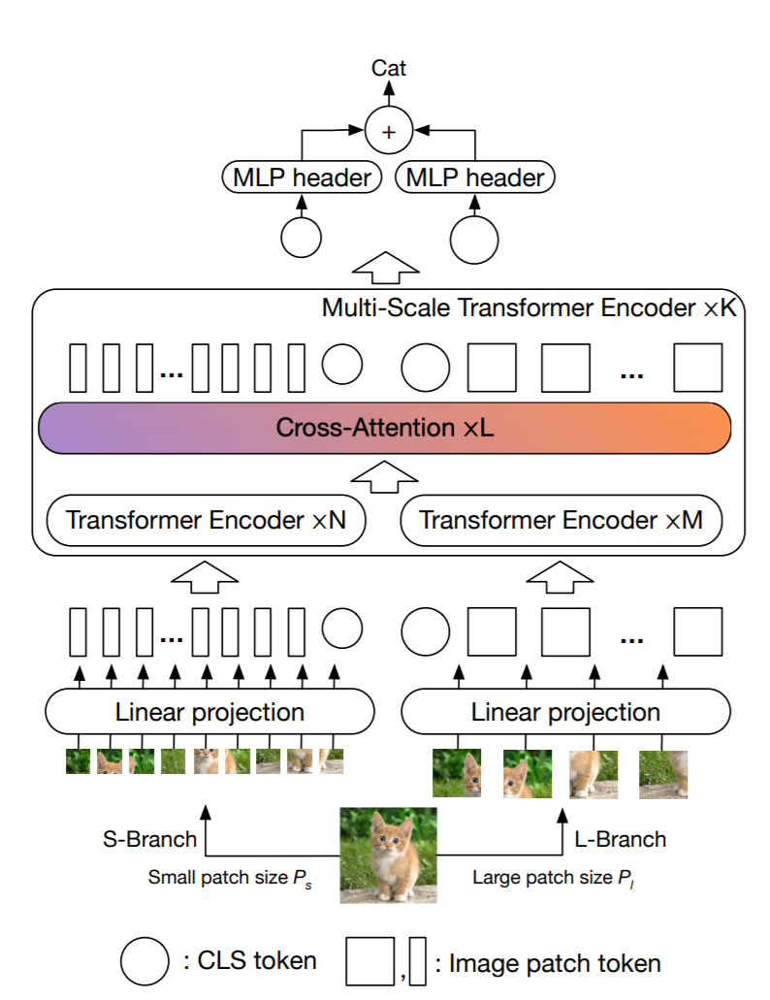

# CrossViT : Cross-Attention Multi-Scale Vision Transformer for Video Classification
This is an unofficial PyTorch implementation of [CrossViT: Cross-Attention Multi-Scale Vision Transformer for Image Classification](https://arxiv.org/abs/2103.14899) .



## Training
```
python train.py -c configs/default.yaml --name "name_of_exp"
```
## Usage :
```python
import torch
from cross_vivit import CrossViT

img = torch.ones([16, 16, 3, 224, 224])

model = CrossViT(224, 3, 1000, 16, 16)

parameters = filter(lambda p: p.requires_grad, model.parameters())
parameters = sum([np.prod(p.size()) for p in parameters]) / 1_000_000
print('Trainable Parameters: %.3fM' % parameters)

out = model(img)

print("Shape of out :", out.shape)      # [B, num_classes]


```


## Note :
* This Repo is Work In Progress.

## Citation
```
@misc{chen2021crossvit,
      title={CrossViT: Cross-Attention Multi-Scale Vision Transformer for Image Classification}, 
      author={Chun-Fu Chen and Quanfu Fan and Rameswar Panda},
      year={2021},
      eprint={2103.14899},
      archivePrefix={arXiv},
      primaryClass={cs.CV}
}
```

## Acknowledgement
* Base ViT code is borrowed from [@lucidrains](https://github.com/lucidrains) repo : https://github.com/lucidrains/vit-pytorch
